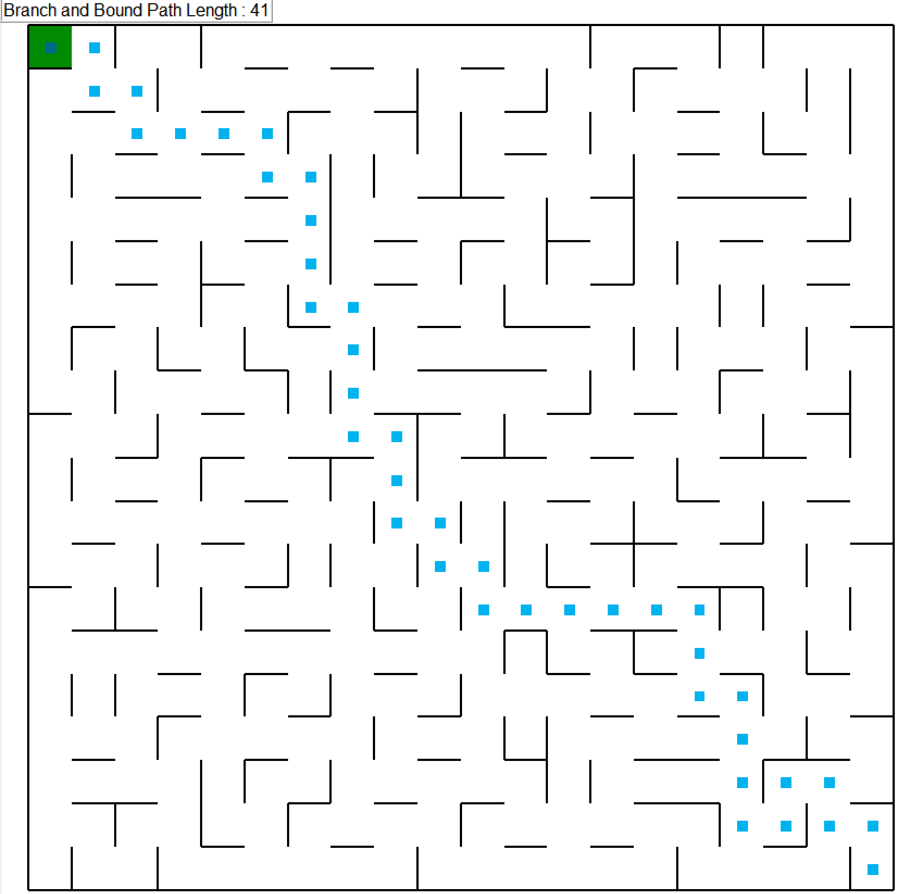
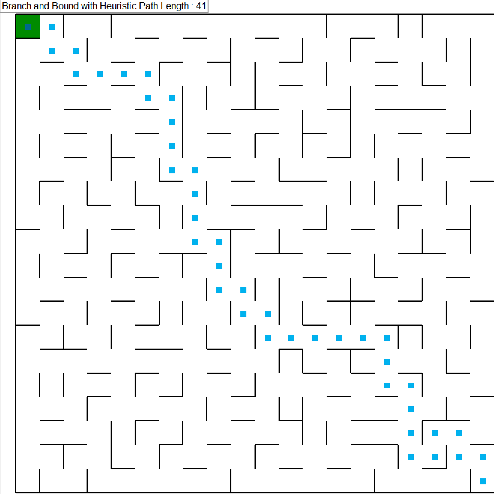
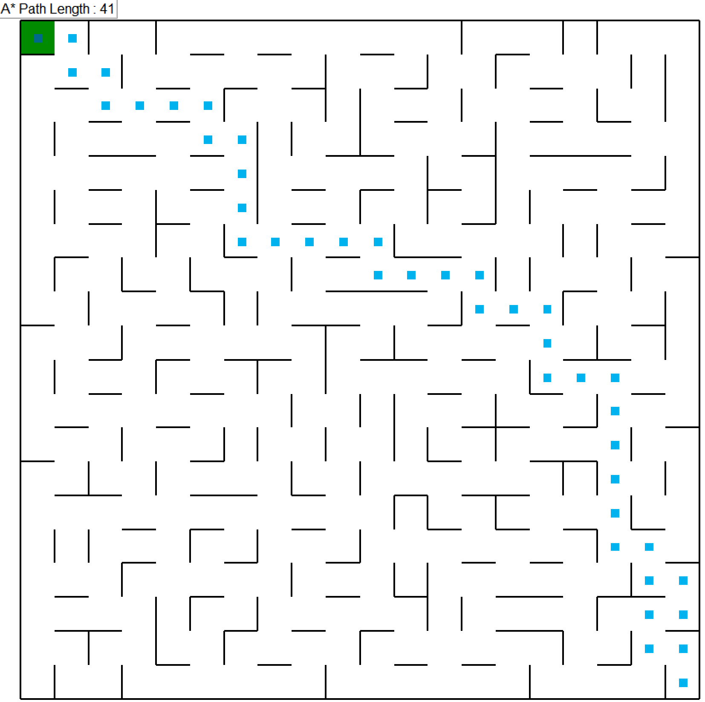

# Maze Pathfinding Algorithm Comparison

A Python implementation and visual comparison of three shortest-path search algorithms on randomly generated mazes:

- Branch and Bound
- Branch and Bound with a Euclidean-distance heuristic
- A* search with a Manhattan-distance heuristic

The project demonstrates priority-queue search, heuristic design, path reconstruction, object-oriented Python, graphical visualization, and repeatable runtime benchmarking.

## Highlights

- Runs every algorithm on the same maze for a fair comparison.
- Searches from the bottom-right cell to the top-left goal.
- Animates each solution with `pyamaze`.
- Measures execution time with Python's high-resolution performance timer.
- Reports mean runtime and standard deviation over repeated trials.
- Verifies that all algorithms return paths with the same cost.
- Includes automated tests and a GitHub Actions workflow.

## Algorithms

| Algorithm | Queue priority | Heuristic | Path storage |
| --- | --- | --- | --- |
| Branch and Bound | `g(n)` | None | Complete path in each queue entry |
| Branch and Bound with Heuristic | `g(n) + h(n)` | Euclidean distance | Complete path in each queue entry |
| A* | `g(n) + h(n)` | Manhattan distance | Predecessor map |

Here, `g(n)` is the path cost from the start to node `n`, while `h(n)` estimates the remaining distance to the goal.

## Example Results

For the sample 20 × 20 maze, every algorithm returned an optimal route containing 41 cells, equivalent to 40 moves. The interface reports the number of cells in the path, including both the starting cell and goal cell.

### Branch and Bound



### Branch and Bound with Heuristic



### A* Search



When a maze contains multiple routes with the same cost, two optimal algorithms may return different routes. Equal route cost, rather than identical footprints, is the important correctness condition.

## Project Structure

```text
maze-pathfinding-algorithms/
├── .github/
│   └── workflows/
│       └── tests.yml
├── images/
│   ├── a-star.png
│   ├── branch-and-bound.png
│   └── branch-and-bound-heuristic.png
│── test_algorithms.py
├── .gitignore
├── LICENSE
├── README.md
├── main.py
└── requirements.txt
```

## Requirements

- Python 3.9 or later
- A desktop environment with Tkinter support for visualization

## Installation

Clone the repository:

```bash
git clone https://github.com/YOUR-USERNAME/maze-pathfinding-algorithms.git
cd maze-pathfinding-algorithms
```

Create and activate a virtual environment:

```bash
python -m venv .venv
```

Windows PowerShell:

```powershell
.venv\Scripts\Activate.ps1
```

macOS or Linux:

```bash
source .venv/bin/activate
```

Install the dependencies:

```bash
python -m pip install --upgrade pip
python -m pip install -r requirements.txt
```

## Usage

Run the application:

```bash
python main.py
```

On Windows, `py main.py` can be used instead.

The program performs the following steps:

1. Generates and saves a 20 × 20 maze.
2. Solves and visualizes it with Branch and Bound.
3. Reloads the same maze and runs heuristic Branch and Bound.
4. Reloads it again and runs A*.
5. Benchmarks all three algorithms over 100 trials.
6. Displays a bar chart containing the mean runtime and standard deviation.
7. Confirms whether all returned paths have the same cost.

Close each maze window to continue to the next algorithm. The path animation uses a 50 ms delay per step.

## Configuration

Change the maze dimensions in `main.py`:

```python
rows, cols = 20, 20
```

Change the number of benchmark trials:

```python
means, stds, labels = compare_algorithms(
    algorithms,
    m,
    num_trials=100,
)
```

Change the animation speed by adjusting `delay`:

```python
self.m.tracePath({robot: path}, delay=50)
```

Lower values produce faster movement.

## Running the Tests

Install the development dependency and run the test suite:

```bash
python -m pip install -r requirements-dev.txt
python -m pytest
```

The tests isolate the search logic from the graphical interface, use deterministic maze graphs, and verify:

- one-based maze boundary handling;
- correct start and goal coordinates;
- valid consecutive movements;
- shortest-path cost for all three algorithms; and
- support for both square and rectangular mazes.

## Benchmark Interpretation

Runtime results depend on maze topology, Python version, operating system, and hardware. The implementations also use different path-storage strategies, so the chart compares the complete implementations rather than only their abstract search rules.

## Technologies

- Python
- `queue.PriorityQueue`
- `pyamaze`
- NumPy
- Matplotlib
- pytest
- GitHub Actions

## License

This project is available under the MIT License. See [LICENSE](LICENSE) for details.

## Author

Yan Myo Aung
